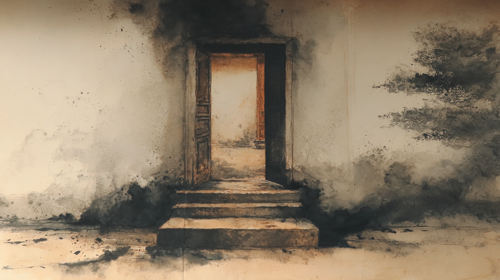
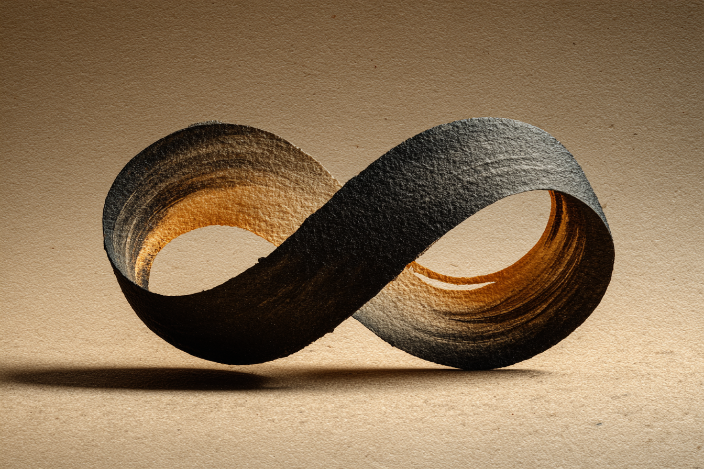

Hello (or good evening) and welcome!

This is a starting point to discover who I am.
Of course, there are plenty of other ways in, and some are even hiddən.

I'm asi0. As for you, I don't know (yet [?](https://crqpt.com/form/qui-es-tu)).

I'm a small piece of this world, a fragment that is, it seems, endowed with consciousness and that uses it to write what I think, and to think what I write.
Lately, I've been enjoying building what I think, too.
If I had to describe my life as a loop, it would be:

> contemplate &rarr; think &rarr; write &rarr; build

but also

> build &rarr; write &rarr; think &rarr; contemplate

And I never quite know in the moment which direction I'm traveling along this loop, which in truth looks more like a Moebius strip.

And as you can see, I build and maintain this site so I can also share what drives me, what stirs my few hundred billion cells, with anyone who wishes to give it some attention.

As you explore this site, you'll find my current and past [telos](/en/telos/). These are simply subjects that occupy my body and mind to the point of spending energy to create digital or physical bubbles of entropy reduction. If that makes no sense, go read the pages associated with my telos -- they should be clearer and more concrete.
You'll also find the [services](/en/services/) I offer as a freelancer (and soon as a company). These are services and deployments of rather customizable solutions that adapt to your needs. Then there are my [explorations](/en/explorations/), which are notes I wish to share that attempt, for better or worse, to illustrate concepts, ideas, or lines of reasoning that have perhaps obsessed me a little too much -- I may be unwittingly spreading a few "mind virus," so I want to say that you cannot hold me responsible for any persistent thought that might accompany you after one of your readings.

With that, thank you for your time and attention.

And happy exploring.
